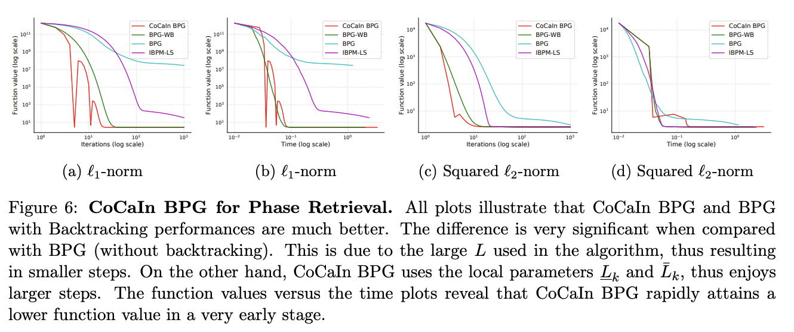

##  Fast Inertial Algorithm for Phase Retrieval

## [Convex-Concave Backtracking for Inertial Bregman Proximal Gradient Algorithms in Non-Convex Optimization](https://arxiv.org/abs/1904.03537) 
by Mahesh Chandra Mukkamala, Peter Ochs, Thomas Pock and Shoham Sabach.

## Related Repositories:
**[CoCaIn BPG escapes Spurious Stationary Points](https://github.com/mmahesh/cocain-bpg-escapes-spurious-stationary-points)**

**[CoCaIn BPG for Matrix Factorization](https://github.com/mmahesh/cocain-bpg-matrix-factorization)**

## Algorithms Implemented:

**BPG**: Bregman Proximal Gradient (BPG)   
**CoCaIn BPG**: Convex Concave Inertial (CoCaIn) BPG  
**BPG-WB**: BPG with Backtracking  
**IBPM-LS**: Inexact Bregman Proximal Minimization Line Search Algorithm

### Dependencies
- numpy, matplotlib

If you have installed above mentioned packages you can skip this step. Otherwise run  (maybe in a virtual environment):

    pip install -r requirements.txt

## Reproduce results

To generate results 

    chmod +x generate_results.sh
    ./generate_results.sh

Then to create the plots
    
    chmod +x generate_plots.sh
    ./generate_plots.sh

Now you can check **figures** folder for various figures. 

## Description of results

The function number is denoted as **fun_num**. 

In **fun_num**  1 : L1-Regularization is used.  
In **fun_num**  2 : Squared L2-Regularization is used.  

## Results

## Citation

    @techreport{MOPS19,
    title        = {Convex-Concave Backtracking for Inertial Bregman Proximal Gradient Algorithms in Non-Convex Optimization},
    author       = {M.C. Mukkamala and P. Ochs and T. Pock and S. Sabach},
    year         = {2019},
    journal      = {ArXiv e-prints, arXiv:1904.03537},
    }

## Contact 
Mahesh Chandra Mukkamala (mukkamala@math.uni-sb.de)

## References

M. C. Mukkamala, P. Ochs, T. Pock, and S. Sabach: Convex-Concave Backtracking for Inertial Bregman Proximal Gradient Algorithms in Non-Convex Optimization. ArXiv e-prints, arXiv:1904.03537, 2019.

P. Ochs, J. Fadili, and T. Brox. Non-smooth Non-convex Bregman Minimization: Unification and  New Algorithms. Journal of Optimization Theory and Applications, 181(1):244–278, 2019.

J. Bolte, S. Sabach, M. Teboulle, and Y. Vaisbourd. First Order Methods Beyond Convexity and Lipschitz Gradient Continuity with Applications to  Quadratic Inverse Problems. SIAM Journal on Optimization, 28(3):2131–2151, 2018.

## License

[Check here.](LICENSE)

